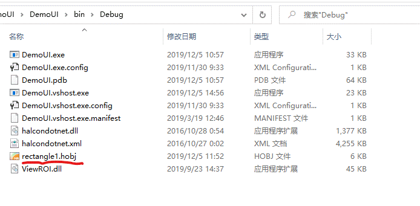

## 上位机应用实例 ##
- C# WPF 语言
- 页面设计
    - 主页
        - 主视图
        - 信息打印框
        - 操作面板
        - 连接状态
        - 循环周期
    - 参数
- 扫码枪
- PLC 
- wpf嵌套halcon编程

***
## wpf嵌套halcon编程 ##
1. 框架图
 - 软件框架图
 -   
 - 库文件
 - [halcondotnet.dll](C:\Program Files\MVTec\HALCON-13.0\bin\dotnet35\halcondotnet.dll "halcondotnet类库")
 - [ViewROI.dll](ViewROI.dll "ViewROI类库")
 - [CameraOperate.cs](CameraOperate.cs "CameraOperate.cs源程序")
 - 初始化
```
HWndCtrl viewController1;//halcon窗口控制器
ROIController roiController1;
CameraOperate Camera = new CameraOperate();//相机操作
//构造函数
public MainWindow()
{
    viewController1 = new HWndCtrl(ImageWindow1);//HWindowControlWPF窗口给到窗口控制器
    roiController1 = new ROIController();
    viewController1.useROIController(roiController1);
    viewController1.setViewState(HWndCtrl.MODE_VIEW_MOVE);
}
```
2. 显示图片和ROI  
```  
viewController1.addIconicVar(Camera.CurrentImage);//添加图片到控件
viewController1.repaint();//画面重画(或更新画面)
viewController1.addIconicVar(symbolXLD1);//添加XLD到控件
viewController1.viewPort.HalconWindow.SetColor("green");//设置窗口显示控件的颜色
viewController1.repaint();//更新
```  
3. 画ROI、保存和读取ROI
 - 画ROI
 - 鼠标左键开始画，点击鼠标右键结束  
```
HOperatorSet.DrawRectangle1(viewController1.viewPort.HalconWindow, out row1, out column1, out row2, out column2);
HOperatorSet.GenRectangle1(out rec1, row1, column1, row2, column2);
```
 - 
 - 保存ROI
```
HOperatorSet.WriteRegion(rec1, System.Environment.CurrentDirectory + "\\rectangle1.hobj");
```
 - 

 - 读取ROI
```
HOperatorSet.ReadRegion(out rec1, System.Environment.CurrentDirectory + "\\rectangle1.hobj");
```
4. 保存和读取图片
 - 文件对话框OpenFileDialog、SaveFileDialog
 - Winform控件，需要添加引用:System.Windows.Forms,需要引用System.Windows.Forms名称空间
 - 

 - 保存图片
```
private void SaveImageButtonClick(object sender, RoutedEventArgs e)
{
	SaveFileDialog saveDlg = new SaveFileDialog();//打开保存文件对话框
	saveDlg.Filter = "图片(*.bmp)|*.bmp";
	if (saveDlg.ShowDialog() == System.Windows.Forms.DialogResult.OK)
	{
	    Camera.SaveImage("bmp", saveDlg.FileName);//保存图片
	}
}
```
 - 读取图片
```
private void ReadImageButtonClick(object sender, RoutedEventArgs e)
{
    OpenFileDialog ofd = new OpenFileDialog();//打开读取文件对话框
    ofd.Filter = "Image文件(*.bmp;*.jpg)|*.bmp;*.jpg|所有文件|*.*";
    ofd.ValidateNames = true;
    ofd.CheckPathExists = true;
    ofd.CheckFileExists = true;
    if (ofd.ShowDialog() == System.Windows.Forms.DialogResult.OK)
    {
        string strFileName = ofd.FileName;//获得选择的文件路径
        Camera.ReadImage(strFileName);//读取图片
        viewController1.addIconicVar(Camera.CurrentImage);//显示图片
        viewController1.repaint();//更新
    }
}
```
 - 